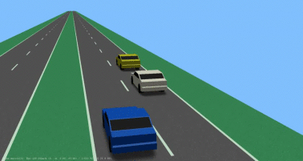
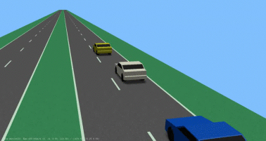
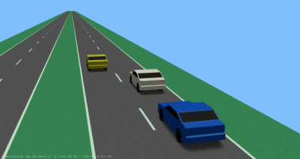
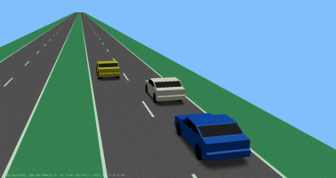
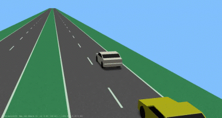
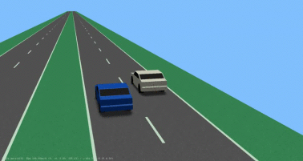
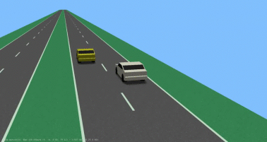

| Scenario name  | Description |  Preview | 
| ------------- | ------------- | --------- |
| [2-forwarding-ego-right-f-left-p-right](/scenarios/2lanes/2-forwarding-ego-right/2-forwarding-ego-right-f-left-p-right.xosc)  | ego-vehicle drives on the right lane with a preceding vehicle and a following vehicle on the left  |    | 
| [2-forwarding-ego-right-f-p-right-p-cutout](/scenarios/2lanes/2-forwarding-ego-right/2-forwarding-ego-right-f-p-right-p-cutout.xosc)  | ego-vehicle drives on the right lane with a preceding vehicle and a following vehicle; a cut-out to the left happens in front of the ego-vehicle  |    | 
| [2-forwarding-ego-right-f-right-cutin](/scenarios/2lanes/2-forwarding-ego-right/2-forwarding-ego-right-f-right-cutin.xosc)  | ego-vehicle drives on the right lane with a following vehicle; a cut-in from the left happens in front of the ego-vehicle  |    | 
| [2-forwarding-ego-right-f-right-f-cutout](/scenarios/2lanes/2-forwarding-ego-right/2-forwarding-ego-right-f-right-f-cutout.xosc)  | ego-vehicle drives on the right lane with a preceding vehicle and a following vehicle; a cut-out to the left happens behind the ego-vehicle  |    | 
| [2-forwarding-ego-right-overtaken-f-right](/scenarios/2lanes/2-forwarding-ego-right/2-forwarding-ego-right-overtaken-f-right.xosc)  | ego-vehicle drives on the right lane with a following vehicle while being overtaken  |    | 
| [2-forwarding-ego-right-overtaken](/scenarios/2lanes/2-forwarding-ego-right/2-forwarding-ego-right-overtaken.xosc)  | ego-vehicle drives on the right lane while being overtaken  |    | 
| [2-forwarding-ego-right-p-left](/scenarios/2lanes/2-forwarding-ego-right/2-forwarding-ego-right-p-left.xosc)  | ego-vehicle drives on the right lane with a preceding vehicle on the left  |    | 

[level up](../)

[back to main](/)

