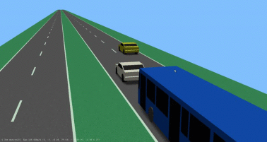
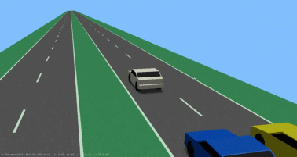
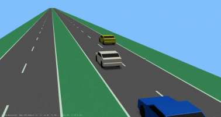
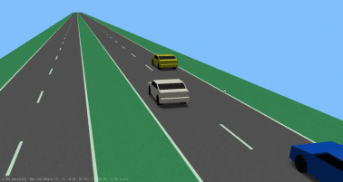
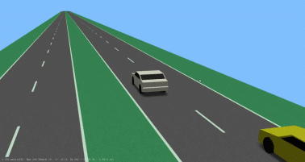
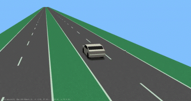
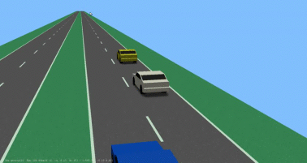
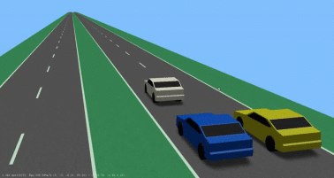

| Scenario name  | Description |  Preview | 
| ------------- | ------------- | --------- |
| [2-lanechange-ego-left-f-left-f-right-p-right](/scenarios/2lanes/2-lanechange/2-lanechange-ego-left-f-left-f-right-p-right.xosc)  | ego-vehicle performs a lane change from the left lane to the right lane with a following vehicle on the starting lane and a preceding vehicle on the target lane and a following lane on the target lane  |    | 
| [2-lanechange-ego-left-f-left-f-right](/scenarios/2lanes/2-lanechange/2-lanechange-ego-left-f-left-f-right.xosc)  | ego-vehicle performs a lane change from the left lane to the right lane with a following vehicle on the starting lane and a following vehicle on the target lane  |    | 
| [2-lanechange-ego-left-f-left-p-right](/scenarios/2lanes/2-lanechange/2-lanechange-ego-left-f-left-p-right.xosc)  | ego-vehicle performs a lane change from the left lane to the right lane with a following vehicle on the starting lane and a preceding vehicle on the target lane  |    | 
| [2-lanechange-ego-left-f-right-p-right](/scenarios/2lanes/2-lanechange/2-lanechange-ego-left-f-right-p-right.xosc)  | ego-vehicleperforms a lanechange from the left lane to the right lane with a preceding vehicle on the target lane and a following lane on the target lane  |    | 
| [2-lanechange-ego-left-f-right](/scenarios/2lanes/2-lanechange/2-lanechange-ego-left-f-right.xosc)  | ego-vehicle performs a lane change from the left lane to the right lane with a following vehicle on the target lane  |    | 
| [2-lanechange-ego-left](/scenarios/2lanes/2-lanechange/2-lanechange-ego-left.xosc)  | ego vehicle performs a lane change from the left lane to the right lane  |    | 
| [2-lanechange-ego-right-f-left-p-right](/scenarios/2lanes/2-lanechange/2-lanechange-ego-right-f-left-p-right.xosc)  | ego-vehicle performs a lane change from the right lane to the left lane with a preceding vehicle on the starting lane and a following vehicle on the target lane  |    | 
| [2-lanechange-ego-right-p-left-p-right](/scenarios/2lanes/2-lanechange/2-lanechange-ego-right-p-left-p-right.xosc)  | ego-vehicle performs a lane change from the right lane to the left lane with a preceding vehicle on the starting lane and a preceding vehicle on the target lane  |    | 

[level up](../)

[back to main](/)

