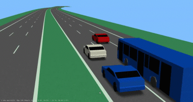
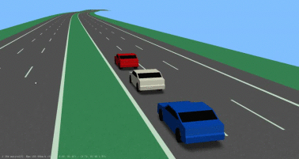
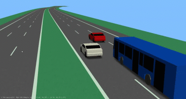
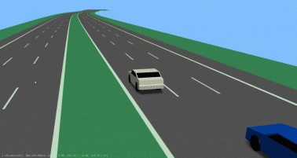
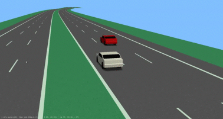
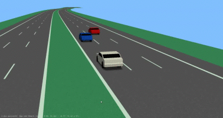
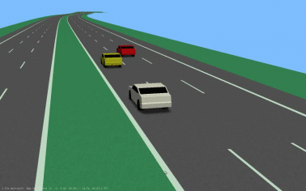

| Scenario name  | Description |  Preview | 
| ------------- | ------------- | --------- |
| [3-forwarding-ego-left-f-left-fp-right](/scenarios/3lanes/3-forwarding-ego-left/3-forwarding-ego-left-f-left-fp-right.xosc)  | ego-vehicle drives on the left lane with a following vehicle and a preceding vehicle on the right and a following vehicle on the right  |    | 
| [3-forwarding-ego-left-f-left-overtake](/scenarios/3lanes/3-forwarding-ego-left/3-forwarding-ego-left-f-left-overtake.xosc)  | ego-vehicle drives on the left lane with a following vehicle while overtaking a vehicle on the right  |    | 
| [3-forwarding-ego-left-f-p-left](/scenarios/3lanes/3-forwarding-ego-left/3-forwarding-ego-left-f-p-left.xosc)  | ego-vehicle drives on the left lane with a preceding vehicle and a following vehicle  |    | 
| [3-forwarding-ego-left-f-p-right](/scenarios/3lanes/3-forwarding-ego-left/3-forwarding-ego-left-f-p-right.xosc)  | ego-vehicle drives on the left lane with a preceding vehicle on the right and a following vehicle on the right  |    | 
| [3-forwarding-ego-left-f-right-cutinbehind](/scenarios/3lanes/3-forwarding-ego-left/3-forwarding-ego-left-f-right-cutinbehind.xosc)  | ego-vehicle drives on the left lane with a following vehicle on the right; a cut-in happens from the right behind the ego-vehicle  |    | 
| [3-forwarding-ego-left-overtake](/scenarios/3lanes/3-forwarding-ego-left/3-forwarding-ego-left-overtake.xosc)  | ego-vehicle drives on the left lane with a preceding vehicle on the right and a following vehicle on the right  |    | 
| [3-forwarding-ego-left-p-left-overtake](/scenarios/3lanes/3-forwarding-ego-left/3-forwarding-ego-left-p-left-overtake.xosc)  | ego-vehicle drives on the left lane with a preceding vehicle while overtaking a vehicle on the right  |    | 
| [3-forwarding-ego-left-p-left-p-right](/scenarios/3lanes/3-forwarding-ego-left/3-forwarding-ego-left-p-left-p-right.xosc)  | ego-vehicle drives on the left lane with a preceding vehicle and a preceding vehicle on the right  |    | 

[level up](../)

[back to main](/)

