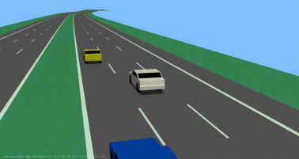
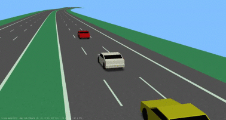
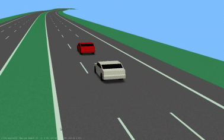
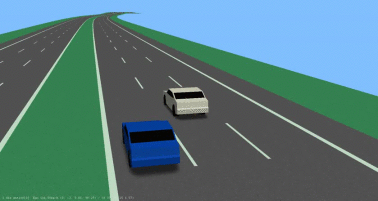
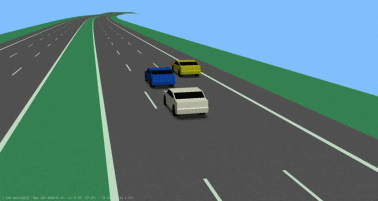

| Scenario name  | Description |  Preview | 
| ------------- | ------------- | --------- |
| [3-forwarding-ego-middle-f-left-p-left](/scenarios/3lanes/3-forwarding-ego-middle/3-forwarding-ego-middle-f-left-p-left.xosc)  | ego-vehicle drives on the middle lane with a preceding vehicle on the left and a following vehicle on the left |    | 
| [3-forwarding-ego-middle-f-p-middle-left-overtake-twice](/scenarios/3lanes/3-forwarding-ego-middle/3-forwarding-ego-middle-f-p-middle-left-overtake-twice.xosc)  | ego-vehicle drives on the middle lane with a preceding and a following vehicle while being overtaken on the left  |    | 
| [3-forwarding-ego-middle-f-p-middle-left-overtake](/scenarios/3lanes/3-forwarding-ego-middle/3-forwarding-ego-middle-f-p-middle-left-overtake.xosc)  | ego-vehicle drives on the middle lane with a preceding and a following vehicle while being overtaken on the left  |    | 
| [3-forwarding-ego-middle-left-overtake-cutin](/scenarios/3lanes/3-forwarding-ego-middle/3-forwarding-ego-middle-left-overtake-cutin.xosc)  | ego-vehicle drives on the middle lane while being overtaken on the left; a cut-in happens from the left in front of the ego-vehicle  |    | 
| [3-forwarding-ego-middle-p-middle-p-right](/scenarios/3lanes/3-forwarding-ego-middle/3-forwarding-ego-middle-p-middle-p-right.xosc)  | ego-vehicle drives on the middle lane with a preceding vehicle and a preceding vehicle on the right  |    | 

[level up](../)

[back to main](/)

