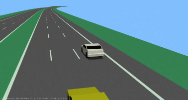
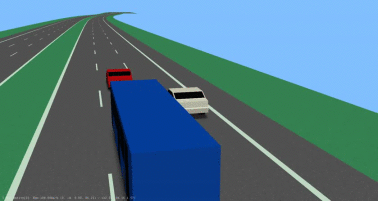
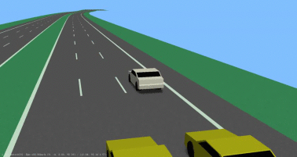
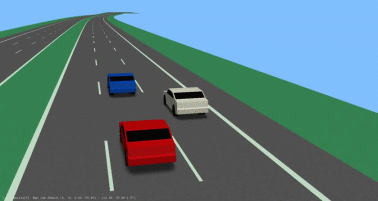
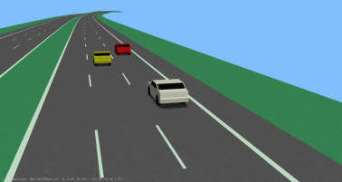
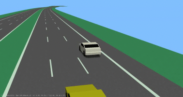
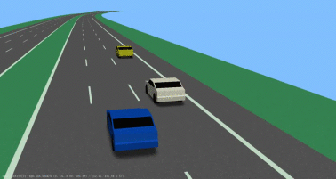

| Scenario name  | Description |  Preview | 
| ------------- | ------------- | --------- |
| [3-forwarding-ego-right-f-middle](/scenarios/3lanes/3-forwarding-ego-right/3-forwarding-ego-right-f-middle.xosc)  | ego-vehicle drives on the right lane with a preceding vehicle and a preceding vehicle on the left  |    | 
| [3-forwarding-ego-right-f-p-middle](/scenarios/3lanes/3-forwarding-ego-right/3-forwarding-ego-right-f-p-middle.xosc)  | ego-vehicle drives on the right lane with a preceding vehicle on the left and a following vehicle on the left  |    | 
| [3-forwarding-ego-right-f-right-f-middle](/scenarios/3lanes/3-forwarding-ego-right/3-forwarding-ego-right-f-right-f-middle.xosc)  | ego-vehicle drives on the right lane with a following vehicle and a following vehicle on the left  |    | 
| [3-forwarding-ego-right-left-overtake-twice-cutin](/scenarios/3lanes/3-forwarding-ego-right/3-forwarding-ego-right-left-overtake-twice-cutin.xosc)  | ego-vehicle drives on the right lane while being overtaken two times on the left; a cut-in happens from the left in front of the ego-vehicle  |    | 
| [3-forwarding-ego-right-p-middle-p-right](/scenarios/3lanes/3-forwarding-ego-right/3-forwarding-ego-right-p-middle-p-right.xosc)  | ego-vehicle drives on the right lane with a preceding vehicle and a preceding vehicle on the left  |    | 
| [3-forwarding-ego-right-p-middle_](/scenarios/3lanes/3-forwarding-ego-right/3-forwarding-ego-right-p-middle_.xosc)  | ego-vehicle drives on the right lane with a preceding vehicle and a preceding vehicle on the left  |    | 
| [3-forwarding-ego-right-p-right-overtake-twice](/scenarios/3lanes/3-forwarding-ego-right/3-forwarding-ego-right-p-right-overtake-twice.xosc)  | ego-vehicle drives on the right lane with a preceding vehicle while being overtaken two times on the left  |    | 

[level up](../)

[back to main](/)

