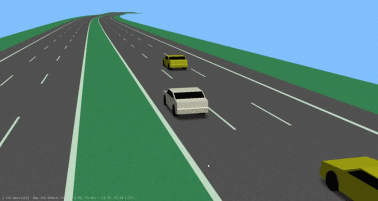
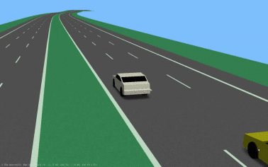
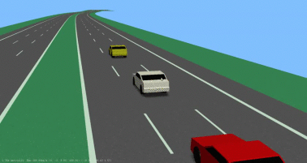
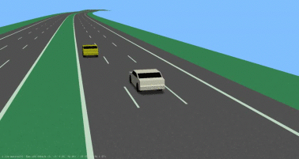
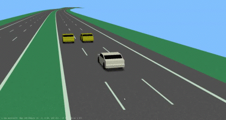
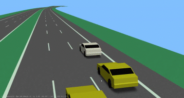
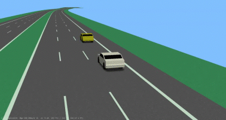
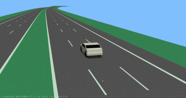
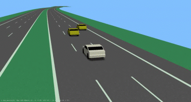
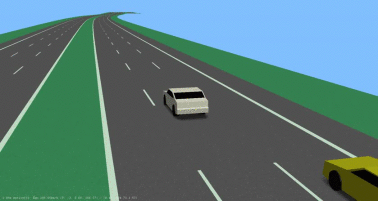

| Scenario name  | Description |  Preview | 
| ------------- | ------------- | --------- |
| [3-lanechange-ego-left-f-middle-p-middle](/scenarios/3lanes/3-lanechange/3-lanechange-ego-left-f-middle-p-middle.xosc)  | ego-vehicle performs a lane change from the left lane to the middle lane with a preceding vehicle on the target lane and a following vehicle on the target lane   |    | 
| [3-lanechange-ego-left-f-middle](/scenarios/3lanes/3-lanechange/3-lanechange-ego-left-f-middle.xosc)  | ego-vehicle performs a lane change from the left lane to the middle lane with a following vehicle on the target   |    | 
| [3-lanechange-ego-middle-f-middle-p-middle-p-left](/scenarios/3lanes/3-lanechange/3-lanechange-ego-middle-f-middle-p-middle-p-left.xosc)  | ego-vehicle performs a lane change from the middle lane to the left lane with a preceding vehicle on the starting lane and following vehicle on the starting lane and a preceding vehicle on the target lane  |    | 
| [3-lanechange-ego-middle-f-middle-p-middle](/scenarios/3lanes/3-lanechange/3-lanechange-ego-middle-f-middle-p-middle.xosc)  | ego-vehicle performs a lane change from the middle lane to the left lane with a following vehicle on the starting lane and a preceding vehicle on the starting lane  |    | 
| [3-lanechange-ego-middle-p-left](/scenarios/3lanes/3-lanechange/3-lanechange-ego-middle-p-left.xosc)  | ego-vehicle performs a lane change from the middle lane to the left lane with a preceding vehicle on the target lane  |    | 
| [3-lanechange-ego-middle-p-middle-p-left](/scenarios/3lanes/3-lanechange/3-lanechange-ego-middle-p-middle-p-left.xosc)  | ego-vehicle performs a lane change from the middle lane to the left lane with a preceding on the starting lane and a preceding on the target lane  |    | 
| [3-lanechange-ego-middle-p-middle](/scenarios/3lanes/3-lanechange/3-lanechange-ego-middle-p-middle.xosc)  | ego-vehicle performs a lane change from the middle lane to the left lane with a preceding vehicle on the starting lane  |    | 
| [3-lanechange-ego-right-f-middle-f-right](/scenarios/3lanes/3-lanechange/3-lanechange-ego-right-f-middle-f-right.xosc)  | ego-vehicle performs a lane change from the right lane to the middle lane with a following vehicle on the starting lane and a following vehicle on the target lane  |    | 
| [3-lanechange-ego-right-p-right](/scenarios/3lanes/3-lanechange/3-lanechange-ego-right-p-right.xosc)  | ego-vehicle performs a lane change from the right lane to the middle lane with a preceding vehicle on the starting lane  |    | 
| [3-lanechange-right-ego-middle-f-right](/scenarios/3lanes/3-lanechange/3-lanechange-right-ego-middle-f-right.xosc)  | ego-vehicle performs a lane change from the middle lane to the right lane with a following vehicle on the target lane  |    | 
| [3-lanechange-right-ego-middle-p-middle-p-right](/scenarios/3lanes/3-lanechange/3-lanechange-right-ego-middle-p-middle-p-right.xosc)  | ego-vehicle performs a lane change from the middle lane to the right lane with a preceding on the starting lane and a preceding on the target lane  |    | 
| [3-lanechange-right-ego-right-f-middle-f-right](/scenarios/3lanes/3-lanechange/3-lanechange-right-ego-right-f-middle-f-right.xosc)  | ego-vehicle performs a lane change from the middle lane to the right lane with a following vehicle on the starting lane and a following vehicle on the target lane  |    | 

[level up](../)

[back to main](/)

